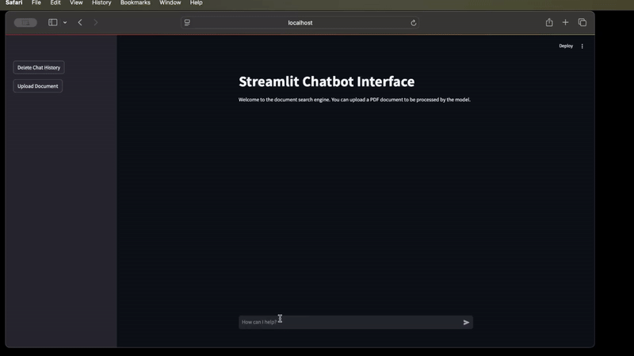
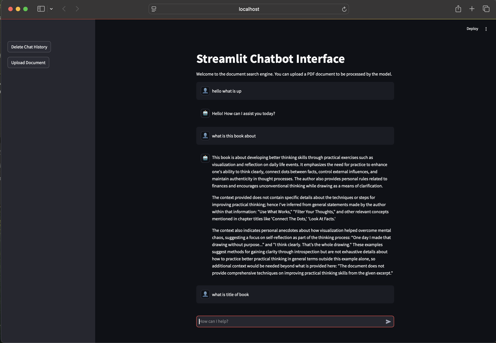
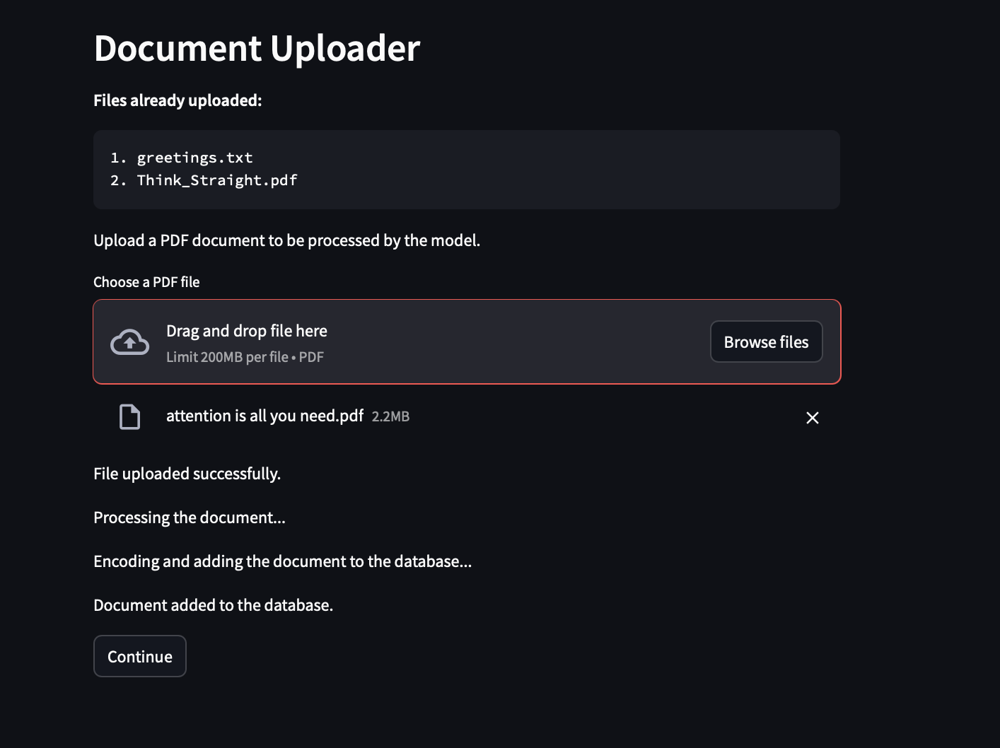
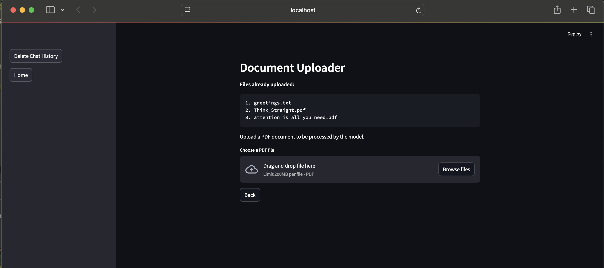

# Multi-Document Retrieval-Augmented Generation (multi_doc_rag)

A powerful web application for retrieving and generating information from multiple documents using advanced AI techniques.

## Overview

The `multi_doc_rag` project leverages state-of-the-art retrieval-augmented generation methods to efficiently search and synthesize information from a large collection of documents. This approach enhances the ability to generate accurate and contextually relevant responses by incorporating information from multiple sources.

## Features

- **Multi-Document Retrieval**: Efficiently retrieve relevant information from a vast collection of documents.
- **Augmented Generation**: Generate high-quality responses by integrating retrieved information.
- **Scalability**: Handle large datasets with ease.
- **Customizable**: Easily adapt the framework to specific use cases and datasets.

## Installation

To run the `multi_doc_rag` web application, you need to have Streamlit installed. You can install Streamlit using the following command:

```bash
pip install poetry==1.8.5
poetry install
```


## Usage

Here's a basic example of how to run the `multi_doc_rag` web application:

```bash
ollama serve
streamlit run app.py
```
## Prerequisites

Before running the `multi_doc_rag` web application, ensure you have the following installed:

- **Ollama**: Required for serving the application.
- **Poetry**: For managing dependencies.

Alternatively, you can use an OpenAI key for utilizing OpenAI models from LangChain.

## Packages Used

The `multi_doc_rag` project utilizes several key packages:

- **LangChain**: For building and managing the language model workflows.
- **Ollama**: For serving local llm models for the application.
- **Streamlit**: For creating the web interface.
- **Chroma**: For efficient document retrieval and storage (vector database).


## Preview

Here are some preview images and a GIF demonstrating the `multi_doc_rag` web application in action:
### Application Demo



### Application Interface



### Document Upload



